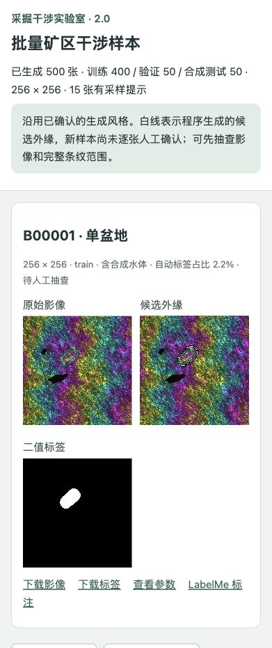

# Mining InSAR Lab 2.0 · 矿区干涉模拟器

独立实现的矿区沉降干涉影像生成器：**先审核影像与完整条纹范围，再批量生成可用于混合训练的合成样本**。
Python 3.11+，NumPy、Pillow；读取训练样本时可另装 PyTorch。MIT 许可。

2.0 是本次重做的公开发行名称，源码包版本为 `2.0.0`。数值引擎仍使用
`mine-simulator-reboot-3.2` 等独立标识，避免破坏已保存实验的重现契约。
旧路线的 2.1–2.9 开发记录保留在版本记录与历史说明中。

## 2.0 的功能

- **20 张审核工作台**：单盆地、双盆地重叠/分离、小目标、边缘截断和背景负样本；简洁/高级参数、放大看外缘、精确栅格画笔、旧版本保留。
- **自己的生成核心**：工作面高斯影响积分与推进时间响应、LOS 投影、背景相位、合成 DEM/误差、随机水体、相关复高斯观测及复数空间平均。
- **批量生成**：以已确认参数族为基准使用新种子，支持 500 张或其他数量、分组划分、完整性检查和显式断点继续。
- **分页看图**：每页 20 张，可筛选场景、训练/验证/合成测试、水体和采样提示；同时查看原图、候选外缘、二值标签。
- **训练导出**：RGB PNG、同尺寸掩膜、数值 NPZ、参数/来源记录、精确栅格 LabelMe JSON，以及可选 PyTorch 读取器。

本项目未包含第三方模拟器代码、网络权重或生成图像。理论背景仍应按实际采用的方法引用；见 [参考文献与引用边界](docs/REFERENCES.md)。



截图展示本机生成的合成样本。源码包不附带这 500 张数据；每次安装从自己的审核批次开始。

## 安装与打开

在下载的工程根目录执行：

```sh
python3 -m venv .venv
source .venv/bin/activate
python -m pip install -r requirements.txt
python simulator_review.py build --run runs/first_review
python simulator_review.py serve --run runs/first_review --port 8781 --open
```

访问 `http://127.0.0.1:8781/`。Windows 激活环境使用 `.venv\Scripts\activate`。
`build` 只运行一次；之后打开已有批次只运行 `serve`。服务只监听本机。
macOS 完成安装后，也可以双击 `启动实验室.command`：首次生成默认 20 张，之后打开同一批次。

默认使用本工程循环色表。若有自己的兼容索引 BMP，生成时可追加
`--bmp my_reference.bmp`；仅提取色表与亮度统计，不复制原图块、不恢复物理相位。
参考文件由使用者自行保管，不随源码上传。

## 审核后批量生成

逐张检查影像与白色候选外缘，必要时调整阈值或用画笔修正，再点击“影像合适，边界确认”。
审核记录绑定影像、掩膜哈希；修改或重新生成会使原确认失效。
20 张全部确认后运行：

```sh
python simulator_batch.py build --review-run runs/first_review --out exports/batch_500 --count 500 --seed 20261010
python simulator_batch.py validate exports/batch_500
python simulator_batch.py serve exports/batch_500 --port 8782
```

访问 `http://127.0.0.1:8782/`。500 张默认划分为训练 400、验证 50、合成测试 50，
每个独立源只属于一个划分。换种子并指定新输出目录可以生成另一批；跨批次合并须检查来源与划分一致性。
生成被中断时，在同一命令追加 `--resume --resume-note "中断原因与处理说明"`；
程序核对计划和已保存文件，不覆盖已有样本。

**新批量标签是自动候选，状态为 `draft`，不自动继承模板的人工确认。**
生成器校验通过不等于每张边界已经人工认可。采样提示保留在每张参数和查看页中，需要重点抽查。

```text
exports/batch_500/
  images/           RGB 干涉影像
  masks/            0/255 二值标签，精确对应影像像素
  arrays/           形变、背景、相位、DEM、功率等数值字段
  metadata/         参数、单位、引擎、种子、来源与文件哈希
  labelme/          同一标签的精确栅格 JSON
  manifest.json     样本与 train/val/test 划分
  sampling_plan.json
  baseline_receipt.json
  validation.json
  load_dataset.py
  index.html
```

## 怎么作为训练集的一部分

安装 `requirements-training.txt` 后，把导出目录加入 Python 的模块路径：

```python
import sys
from torch.utils.data import DataLoader

sys.path.insert(0, "exports/batch_500")
from load_dataset import SyntheticRanges

# 明确允许自动候选标签用于初步实验；正式研究仍需抽查与修正。
dataset = SyntheticRanges("exports/batch_500", split="train", allow_draft=True)
x, y, group_ids = next(iter(DataLoader(dataset, batch_size=4)))
# x: float32 [B,3,256,256]，RGB/255
# y: float32 [B,1,256,256]，最终导出掩膜的 0/1 值
```

默认读取器拒绝草稿。`masks/` 是训练标签，`arrays.candidate_mask` 保留最初候选；
手工修改后不要用原始候选覆盖最终掩膜。LabelMe 导出使用精确 mask 形状，需支持该形状类型的版本。
同源裁片、颜色变体和增强继承原场景划分；真实数据另按日期/地点划分。
是否改善真实识别，须在固定的独立真实验证/测试上比较“真实单独训练”和“真实 + 合成训练”。

当前发布重点是模拟器和数据导出。旧训练脚本仍保留，接口和监督定义与新版批量导出不同，
使用前阅读 [历史流程](docs/LEGACY_WORKFLOWS.md)；不能把旧模型的结果当成这次 2.0 的效果。

## 标签和科学定义

目标是完整沉降条纹的分割范围。默认候选为：

`abs(clean spatially averaged deformation phase) >= 0.8 rad`

高斯影响函数没有唯一的可见外缘，这个阈值是待审核的范围代理，不是实测真值或经过校准的人工边界。
程序保留内部空洞、小区域和单像素，不按水体或相干性自动删标签；真实 LabelMe 原标注不作修改。

向下位移和 LOS 距离增加为正；形变相位为 `−4π ΔLOS / λ`。
当前 DEM、水体、反射功率和部分形状/相干损失均为合成或经验模型，
尚未校准真实矿区，也没有完整 SAR 成像、真实 DEM 配准或任意影像识别能力的验证。
PNG 色彩是显示编码，不能当作物理相位、沉降或相干性的测量。

完整公式、默认值、增强与审核契约见 [新版模型说明](docs/SIMULATOR_REBOOT.md)。
[MODEL.md](MODEL.md) 描述保留的旧路线，两者的标签与有效区定义不同。

## 检查与源码发布

```sh
python -m pip install -r requirements-dev.txt
ruff check .
ruff format --check .
python -m unittest discover -v
python prepare_release.py
```

源码包为 `dist/mining-insar-lab-2.0.0/` 与同名 ZIP，按明确清单打包。
不包含个人 BMP/LabelMe 原始文件、大批量数据、模型权重、虚拟环境、缓存或本机历史。
完整性/数值测试验证实现契约，不能替代真实矿区验证。

[验证记录](VALIDATION.md) · [复现说明](docs/REPRODUCIBILITY.md) · [发布说明](docs/PUBLICATION.md) · [贡献说明](CONTRIBUTING.md) · [版本记录](CHANGELOG.md) · [MIT 许可](LICENSE)

仓库：<https://github.com/syz556399-hub/mining-insar-lab>。
引用软件时记录发行版本、提交、数值引擎和参数；`CITATION.cff` 使用贡献者集体署名，暂无软件 DOI。
